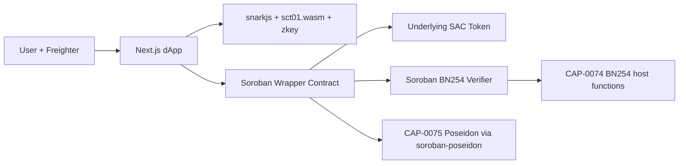

# SCT-01 Codebase Guide

This repository implements a hackathon MVP of a Stellar Confidential Token wrapper. It lets a user lock a public Stellar Asset Contract token, mint a private note commitment, transfer that note privately with a Groth16 proof, and unwrap the note back into the public asset.

The important distinction: this is a real testnet-oriented implementation path, not only UI simulation. The contracts compile to Soroban WASM, the dApp generates browser Groth16 proofs from Circom artifacts, and the wrapper calls a dedicated BN254 verifier contract. It is still not production-ready or audited.

## What We Built

SCT-01 is a note-based confidential asset wrapper:

1. A user wraps public tokens into the wrapper contract.
2. The wrapper transfers the public asset into its vault and appends a 32-byte note commitment to a Poseidon Merkle tree.
3. The user's browser stores the note secret material locally.
4. A private transfer consumes one note, proves membership and value conservation in zero knowledge, publishes one nullifier, and appends two output commitments: recipient output and sender change.
5. An unwrap consumes one note, proves ownership and membership in zero knowledge, publishes one nullifier, and transfers public tokens from the wrapper vault to a recipient.

The current MVP supports:

- One input note per transfer.
- Exactly two transfer outputs: recipient note plus change note.
- One input note per unwrap.
- Exact-note unwrap only; partial unwrap requires a prior confidential transfer that creates the exact change/output shape.
- One underlying asset per wrapper instance.
- One universal circuit for transfer and unwrap.

## Repository Map

- `prd.txt`: product goals and expected confidential token behavior.
- `stack.txt`: chosen stack: Stellar/Soroban, React/Next.js, TypeScript SDK, ZK proof tooling.
- `contracts/wrapper`: Soroban confidential token wrapper contract.
- `contracts/verifier`: Soroban BN254 Groth16 verifier contract.
- `circuits/circom/sct01.circom`: final Circom circuit used by the dApp.
- `circuits/transfer` and `circuits/unwrap`: older Noir circuit scaffolding/artifacts. These are not the live proving path.
- `artifacts/circom`: generated local Circom build artifacts.
- `dapp`: Next.js wallet UI and browser proof generation.
- `dapp/public/circuits`: public WASM/zkey/verifying key consumed by the browser.
- `dapp/public/vendor/snarkjs.min.js`: vendored snarkjs browser bundle.
- `sdk`: TypeScript SDK for notes, commitments, encryption helpers, and partial contract tooling.
- `scripts/build-circom-artifacts.sh`: rebuilds Circom proving artifacts.
- `scripts/pack-snarkjs-proof.mjs`: helper for converting static snarkjs proof output.
- `dapp/scripts/init-verifier-from-vk.mjs`: initializes the verifier contract from `verification_key.json`.

## Architecture



The dApp is the canonical client right now. It computes notes, Merkle paths, binding hashes, Groth16 proofs, and transaction arguments. The wrapper validates public consistency and proof binding. The verifier performs the Groth16 pairing check using the stored verification key.

## On-Chain Contracts

### Wrapper Contract

Main file: `contracts/wrapper/src/lib.rs`

The wrapper stores:

- `Admin`: initializer/admin address.
- `Asset`: underlying Stellar Asset Contract address.
- `Verifier`: verifier contract address.
- `TreeRoot`: current Poseidon Merkle root.
- `NoteCount`: number of commitments inserted.
- `FilledSubtree(level)`: incremental Merkle tree helper state.
- `Commitment(bytes32)`: commitment existence guard.
- `Nullifier(bytes32)`: spent note guard.
- `Metadata`: name, symbol, decimals, version, circuit version, verifier, privacy model.

Public methods:

- `initialize(admin, asset, verifier, name, symbol, decimals)`: one-time setup.
- `wrap(from, amount, commitment, encrypted_note)`: requires `from` auth, transfers public tokens into the wrapper, inserts the commitment, emits a `wrap` event.
- `confidential_transfer(proof, public_inputs, nullifiers, output_commitments, encrypted_notes)`: validates root/asset/hash/public input consistency, calls verifier, marks nullifier spent, inserts two output commitments, emits `conf_transfer`.
- `unwrap(proof, public_inputs, nullifier, recipient, amount)`: validates root/asset/recipient/amount, calls verifier, marks nullifier spent, transfers public asset from wrapper to recipient, emits `unwrap`.
- `is_spent(nullifier)`, `commitment_exists(commitment)`, `root()`, `note_count()`, `asset()`, `metadata()`: read helpers.

Current constants:

- `MAX_NULLIFIERS = 1`
- `MAX_OUTPUTS = 2`
- `TREE_DEPTH = 20`
- `MAX_NOTES = 1_048_576`

The wrapper uses Poseidon over BN254 field elements for:

- Merkle parent hashes.
- Transfer binding hash.
- Unwrap binding hash.

Address fields are derived from Soroban address payload bytes, so the contract, dApp, and circuit all agree on how `G...` and `C...` addresses enter the BN254 field.

### Verifier Contract

Main file: `contracts/verifier/src/lib.rs`

The verifier stores one Groth16 verification key and exposes:

- `initialize(admin, vk, circuit_version)`: stores the verification key once.
- `verify_proof(statement)`: checks action type, checks public signal count, reconstructs the Groth16 linear combination from `vk.ic`, and runs `env.crypto().bn254().pairing_check`.
- `update_vk(vk, circuit_version)`: admin-only verification key rotation.
- `circuit_version()`, `proof_count()`: read helpers.

The wrapper passes two public signals:

1. `action`: `2` for transfer or `3` for unwrap.
2. `binding`: Poseidon hash of the public operation data.

The verifier does not know transfer semantics. It verifies that the proof is valid for the public signals. The wrapper is responsible for constructing the binding from the public transaction data and enforcing asset/root/nullifier/commitment rules.

## Circuit

Main file: `circuits/circom/sct01.circom`

The active circuit is a Circom universal circuit for transfer and unwrap.

Public signals:

- `action`
- `binding`

Private inputs include:

- Note amount, owner, randomness, nullifier key, nullifier secret.
- Merkle path elements and path indices.
- Transfer output amount, owner, randomness, nullifier key, commitment.
- Transfer change amount, owner, randomness, nullifier key, commitment.
- Encrypted note hashes.
- Unwrap recipient and amount.

The circuit proves:

- The spent note commitment is correctly derived.
- The note commitment is included in the current Merkle root.
- The nullifier is correctly derived from note secrets.
- For transfer: `input amount = output amount + change amount`.
- For transfer: output and change commitments are correctly derived.
- For transfer: the public binding matches action/root/asset/nullifier/output commitments/encrypted note hashes.
- For unwrap: `note amount = unwrap amount`.
- For unwrap: the public binding matches action/root/asset/recipient/nullifier/amount.

Generated artifacts:

- `artifacts/circom/sct01.r1cs`
- `artifacts/circom/sct01_final.zkey`
- `artifacts/circom/verification_key.json`
- `dapp/public/circuits/sct01.wasm`
- `dapp/public/circuits/sct01_final.zkey`
- `dapp/public/circuits/verification_key.json`

The current trusted setup is deterministic demo setup. It is acceptable for hackathon/testnet demonstration, not production funds.

## dApp

Main folder: `dapp`

The dApp is a Next.js client app. It uses Freighter for wallet signing, Stellar SDK/RPC for contract calls, Zustand local storage for notes, `poseidon-lite` for browser hashes, and snarkjs for proof generation.

Important files:

- `dapp/src/lib/stellar.ts`: network, RPC, Horizon, contract IDs, amount parsing/formatting.
- `dapp/src/lib/crypto.ts`: SHA-256, random bytes, Poseidon hashing, address-to-field, commitment/nullifier/binding hash helpers.
- `dapp/src/lib/proofs.ts`: loads snarkjs, builds Merkle paths, generates transfer/unwrap Groth16 proofs, converts snarkjs proof JSON to Soroban BN254 proof bytes.
- `dapp/src/lib/contract/index.ts`: builds, simulates, assembles, signs, submits, and polls wrapper contract transactions.
- `dapp/src/store/notes.ts`: persisted local note store.
- `dapp/src/hooks/useNotes.ts`: note creation, note selection, balance, nullifier derivation.
- `dapp/src/hooks/useWallet.ts`: Freighter connection/signing.
- `dapp/src/app/wrap/page.tsx`: wrap flow.
- `dapp/src/app/transfer/page.tsx`: private transfer flow.
- `dapp/src/app/unwrap/page.tsx`: unwrap flow.
- `dapp/src/app/dashboard/page.tsx`: local confidential balance and notes.
- `dapp/src/app/receive/page.tsx`: receive-address UI and intended receive flow explanation.
- `dapp/src/app/explorer/page.tsx`: demo comparison of public chain view vs participant view.

The dApp note store is local browser state. If local storage is cleared, the user loses access to demo notes unless they backed up the note secrets. There is no production key management or note recovery yet.

## SDK

Main folder: `sdk`

The SDK contains reusable TypeScript pieces:

- `sdk/src/crypto/hash.ts`: byte/field/hash utilities.
- `sdk/src/crypto/commitment.ts`: note commitment and nullifier derivation matching the circuit.
- `sdk/src/crypto/encryption.ts`: X25519 plus ChaCha20-Poly1305 note encryption helpers.
- `sdk/src/notes/manager.ts`: in-memory note manager with export/import helpers.
- `sdk/src/proof/generator.ts`: proof-pack conversion and public signal validation. It intentionally does not generate fake proofs.
- `sdk/src/contract/client.ts`: high-level contract client scaffold.
- `sdk/src/types.ts`: shared note/proof/config types.

Important gap: `sdk/src/contract/client.ts` is not fully aligned with the latest wrapper proof argument shape. The dApp contract helper is the current canonical integration path. Contributors should either update the SDK client to match `dapp/src/lib/contract/index.ts` or avoid using the SDK client for live transactions until that is done.

## End-To-End Flows

### Wrap

1. User connects Freighter.
2. dApp reads `note_count()` to know the next leaf index.
3. dApp creates note secrets:
   - `randomness`
   - `nullifierKey`
   - `nullifierSecret`
4. dApp computes commitment:
   - `Poseidon(asset, amount, owner, randomness, nullifierKey)`
5. dApp stores note locally.
6. dApp submits `wrap(from, amount, commitment, encrypted_note)`.
7. Wrapper requires `from` auth, transfers underlying tokens to itself, appends commitment, and emits event.

Wrap does not require a ZK proof because the deposit amount is public.

### Confidential Transfer

1. User selects amount and recipient.
2. dApp selects one unspent local note.
3. dApp reads on-chain `root()` and `note_count()`.
4. dApp builds Merkle path from local commitment leaves.
5. dApp creates recipient output note and sender change note.
6. dApp derives nullifier:
   - `Poseidon(nullifierKey, nullifierSecret)`
7. dApp hashes encrypted note payloads with SHA-256.
8. dApp computes transfer binding:
   - `Poseidon chain(action=2, root, asset, nullifier, outputCommitment0, outputCommitment1, encryptedNoteHash0, encryptedNoteHash1)`
9. Browser generates Groth16 proof using `sct01.wasm` and `sct01_final.zkey`.
10. dApp submits `confidential_transfer(...)`.
11. Wrapper recomputes the same binding, calls verifier, marks nullifier, appends both output commitments, emits event.
12. dApp marks input note spent and stores sender change note.

Public chain sees a transfer happened, the nullifier, output commitments, encrypted note hashes, and submitter. It does not see the transfer amount.

### Unwrap

1. User selects exact note amount and recipient.
2. dApp selects one unspent note whose amount exactly matches the unwrap amount.
3. dApp reads current root and builds Merkle path.
4. dApp derives nullifier.
5. dApp computes unwrap binding:
   - `Poseidon chain(action=3, root, asset, recipient, nullifier, amount)`
6. Browser generates Groth16 proof.
7. dApp submits `unwrap(...)`.
8. Wrapper recomputes binding, calls verifier, marks nullifier, transfers public tokens to recipient, emits event.

Unwrap amount is public because the underlying token transfer is public.

## Local Development

Install dependencies:

```bash
cd /Users/Apple/dev/os/ikem/cstellar/dapp
npm install

cd /Users/Apple/dev/os/ikem/cstellar/sdk
npm install
```

Build and test contracts:

```bash
cd /Users/Apple/dev/os/ikem/cstellar
cargo test
cargo build --release --target wasm32v1-none
```

Build circuit artifacts:

```bash
cd /Users/Apple/dev/os/ikem/cstellar
./scripts/build-circom-artifacts.sh
```

Build SDK:

```bash
cd /Users/Apple/dev/os/ikem/cstellar/sdk
npm run build
npm test
```

Build dApp:

```bash
cd /Users/Apple/dev/os/ikem/cstellar/dapp
npm run build
```

Run dApp:

```bash
cd /Users/Apple/dev/os/ikem/cstellar/dapp
npm run dev
```

Then open `http://localhost:3000`.

## Environment

Copy:

```bash
cd /Users/Apple/dev/os/ikem/cstellar/dapp
cp .env.local.example .env.local
```

Required values:

```bash
NEXT_PUBLIC_STELLAR_NETWORK=testnet
NEXT_PUBLIC_STELLAR_RPC_URL=https://soroban-testnet.stellar.org
NEXT_PUBLIC_STELLAR_HORIZON_URL=https://horizon-testnet.stellar.org
NEXT_PUBLIC_STELLAR_NETWORK_PASSPHRASE="Test SDF Network ; September 2015"
NEXT_PUBLIC_WRAPPER_CONTRACT_ID=<deployed wrapper contract id>
NEXT_PUBLIC_VERIFIER_CONTRACT_ID=<deployed verifier contract id>
NEXT_PUBLIC_ASSET_ADDRESS=<underlying SAC contract id>
```

For a simple testnet demo, native XLM's SAC contract ID can be used as the underlying asset:

```bash
stellar contract id asset --asset native --network testnet
```

## Testnet Deployment Checklist

These commands assume Stellar CLI 26.x and a funded testnet identity named `alice`.

Create/fund identity:

```bash
stellar keys generate alice --network testnet
stellar keys fund alice --network testnet
stellar keys public-key alice
```

Build optimized WASM:

```bash
cd /Users/Apple/dev/os/ikem/cstellar
cargo build --release --target wasm32v1-none
```

Deploy verifier and wrapper:

```bash
VERIFIER_ID=$(stellar contract deploy \
  --wasm target/wasm32v1-none/release/sct01_verifier.wasm \
  --source alice \
  --network testnet)

WRAPPER_ID=$(stellar contract deploy \
  --wasm target/wasm32v1-none/release/sct01_wrapper.wasm \
  --source alice \
  --network testnet)
```

Get underlying asset contract ID:

```bash
ASSET_ID=$(stellar contract id asset --asset native --network testnet)
ADMIN=$(stellar keys public-key alice)
```

Initialize verifier from the generated Circom verification key:

```bash
cd /Users/Apple/dev/os/ikem/cstellar/dapp
STELLAR_SECRET_KEY=$(stellar keys secret alice) \
node scripts/init-verifier-from-vk.mjs "$VERIFIER_ID" ../artifacts/circom/verification_key.json
```

Initialize wrapper:

```bash
stellar contract invoke \
  --id "$WRAPPER_ID" \
  --source alice \
  --network testnet \
  -- initialize \
  --admin "$ADMIN" \
  --asset "$ASSET_ID" \
  --verifier "$VERIFIER_ID" \
  --name cXLM \
  --symbol cXLM \
  --decimals 7
```

Update `dapp/.env.local`:

```bash
NEXT_PUBLIC_WRAPPER_CONTRACT_ID=$WRAPPER_ID
NEXT_PUBLIC_VERIFIER_CONTRACT_ID=$VERIFIER_ID
NEXT_PUBLIC_ASSET_ADDRESS=$ASSET_ID
```

Restart the dApp dev server after changing `.env.local`.

## What Can Be Demoed

A strong demo path:

1. Open `http://localhost:3000`.
2. Connect Freighter on Stellar testnet.
3. Show Dashboard with zero local confidential notes.
4. Go to Wrap.
5. Wrap a small amount of the configured public asset.
6. Show Dashboard now has one unspent confidential note.
7. Go to Transfer.
8. Send part of that note to another Stellar address.
9. Explain that the browser generated a Groth16 proof and the wrapper verified it through the BN254 verifier contract.
10. Show the receipt: nullifier and output commitment are visible, amount is not revealed by the transfer event.
11. Show Dashboard: original input note spent, change note available.
12. Go to Unwrap.
13. Unwrap an exact available note amount.
14. Show public asset transfer completed on testnet.
15. Show Explorer page to explain public vs private views.

Best demo story:

- Wrap is public deposit into private state.
- Transfer hides amount and note ownership from public observers.
- Nullifier prevents double spend.
- Commitments are append-only private outputs.
- Unwrap intentionally reveals amount because it exits to the public asset.

Demo limitation to say plainly:

- The recipient note discovery/decryption flow is not automated yet. For a live stage demo, use one browser/local note store for sender/change, or manually share/import note material when demonstrating recipient ownership.

## Security Review

Current strengths:

- No fake proof acceptance in the live wrapper path: wrapper calls verifier contract.
- Verifier uses BN254 pairing host functions.
- Public signals are bound to operation type and wrapper-computed binding hash.
- Wrapper checks current Merkle root before proving spend.
- Wrapper checks asset address against configured underlying asset.
- Wrapper checks encrypted note hashes match submitted encrypted note payloads.
- Wrapper rejects duplicate commitments and duplicate nullifiers.
- Wrapper transfers underlying asset through SAC token client, not custom balances.
- Admin-only verifier key rotation.
- TTL extension is present for instance and persistent storage entries.

Main risks and gaps:

- Not audited. Do not use with real funds.
- Demo trusted setup is deterministic. Production requires a proper ceremony or a different audited proving setup.
- Browser localStorage stores spend secrets. XSS or local device compromise can steal notes.
- `encrypted_note` payloads in the dApp are JSON demo payloads, not a production recipient encryption/scanning system.
- The SDK encryption helper exists, but it is not wired into the dApp receive flow.
- No automatic recipient note discovery from events.
- No view keys, compliance keys, recovery keys, or institutional audit flow yet.
- No relayer. The transaction submitter remains visible.
- One-input/two-output shape leaks some structure and limits usability.
- Unwrap requires exact note amount.
- Merkle paths are built from local leaves. A robust wallet needs chain event indexing and tree reconstruction.
- SDK contract client is stale relative to current contract argument shapes.
- The `verify_proof_binding` comment in wrapper mentions earlier MVP validation but the implementation now calls the verifier. Update the comment before public release to avoid confusing auditors.
- No frontend hardening beyond normal Next.js defaults. Treat the app as demo UI.
- No rate limits or backend because there is no backend. RPC abuse and frontend availability depend on provider limits.

## Contribution Guide

Use this map when changing behavior:

- Change note commitment formula: update `circuits/circom/sct01.circom`, `contracts/wrapper/src/lib.rs` if public bindings/tree change, `dapp/src/lib/crypto.ts`, `sdk/src/crypto/commitment.ts`, and tests.
- Change transfer public data: update circuit binding, wrapper `transfer_binding_hash`, dApp `transferBindingHash`, proof inputs, and contract call encoding.
- Change unwrap public data: update circuit binding, wrapper `unwrap_binding_hash`, dApp `unwrapBindingHash`, proof inputs, and contract call encoding.
- Add multi-input transfer: update circuit dimensions, wrapper `MAX_NULLIFIERS`, public input checks, binding hash, dApp note selection/proof inputs, SDK types, tests.
- Add partial unwrap: model it as note spend plus public output plus change commitment, or add a new action type and circuit constraints.
- Add recipient receive flow: wire `sdk/src/crypto/encryption.ts` into dApp, include recipient encryption public key, scan wrapper events, decrypt candidate payloads, import received notes, and rebuild local Merkle leaves.
- Align SDK live client: port `dapp/src/lib/contract/index.ts` proof maps and Groth16 proof struct into `sdk/src/contract/client.ts`.
- Improve testnet deployment: add repeatable deploy scripts that build, deploy, initialize verifier, initialize wrapper, and write `.env.local`.

## Validation Commands

Run before handing off changes:

```bash
cd /Users/Apple/dev/os/ikem/cstellar
cargo test
cargo build --release --target wasm32v1-none

cd /Users/Apple/dev/os/ikem/cstellar/sdk
npm run build
npm test
npm audit

cd /Users/Apple/dev/os/ikem/cstellar/dapp
npm run build
npm audit
```

For circuit changes also run:

```bash
cd /Users/Apple/dev/os/ikem/cstellar
./scripts/build-circom-artifacts.sh
```

Then generate at least one transfer proof and one unwrap proof through the browser flow against testnet.

## Known State

What is real/demoable now:

- Soroban wrapper and verifier contracts.
- CAP-0074 BN254 verifier path.
- CAP-0075/Soroban Poseidon hashing path.
- Browser Groth16 proving path.
- Testnet transaction construction for wrap, transfer, unwrap.
- Local note lifecycle for sender and change notes.
- Dashboard and explorer-style explanation UI.

What remains before production-grade confidential tokens:

- Production ceremony/audit.
- Recipient encrypted note delivery and scanning.
- Robust indexer-backed Merkle tree reconstruction.
- Multi-note spends.
- Partial unwrap/change.
- SDK contract client alignment.
- Wallet-grade key storage and backup.
- Better contract integration tests with realistic verifier fixtures.
- Operational deployment scripts and CI.
- Privacy review against metadata leakage and transaction graph leakage.
